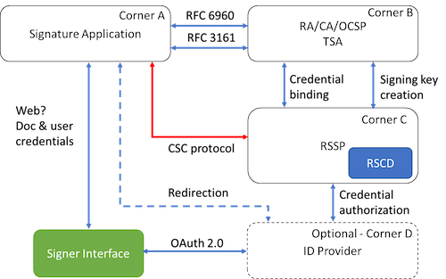

# Abstract 

This document defines the pushed authorization request endpoint, which allows
clients to push the payload of an OAuth 2.0 authorization request to the
authorization server via a direct request and provides them
with a request URI that is used as reference to the data in a subsequent authorization request.   

# Introduction {#Introduction}

OAuth ([RFC 6749](https://tools.ietf.org/html/rfc6749)) authorization request parameters are typically sent as URI query parameters via redirection in the user-agent. This is simple but also yields challenges:

* There is no cryptographical integrity and authenticity protection, i.e. the request can be modified on its way through the user-agent and attackers can impersonate legitimate clients.
* There is no mechanism to ensure confidentiality of the request parameters.
* Authorization request URLs can become quite large, especially in scenarios requiring fine-grained authorization data.

...

For example, the following authorization request,

```HTTP
  GET /authorize?response_type=code
   &client_id=s6BhdRkqt3&state=af0ifjsldkj
   &redirect_uri=https%3A%2F%2Fclient.example.org%2Fcb HTTP/1.1
  Host: as.example.com
       
```

JSON example

```JSON
{  
   "verified_claims":{  
      "verification":{  
         "trust_framework":"de_aml",
         "time":"2012-04-23T18:25:43.511+01",
         "verification_process":"676q3636461467647q8498785747q487",
         "evidence":[  
            {  
               "type":"id_document",
               "method":"pipp",
               "document":{  
                  "type":"idcard",
                  "issuer":{  
                     "name":"Stadt Augsburg",
                     "country":"DE"
                  },
                  "number":"53554554",
                  "date_of_issuance":"2012-04-23",
                  "date_of_expiry":"2022-04-22"
               }
            }
         ]
      },
      "claims":{  
         "given_name":"Max",
         "family_name":"Meier",
         "birthdate":"1956-01-28",
         "place_of_birth":{  
            "country":"DE",
            "locality":"Musterstadt"
         },
         "nationality":"DE",
         "address":{  
            "locality":"Maxstadt",
            "postal_code":"12344",
            "country":"DE",
            "street_address":"An der Sanddüne 22"
         }
      }
   }
}
```

Here is an image



And here is a table

| Identifier | Definition|
|:------------|:-----------|
|`de_aml`    |The OP verifies and maintains user identities in conforms with the German Anti-Money Laundering Law.|
|`eidas_ial_substantial`| The OP is able to attest user identities in accordance with the EU regulation No 910/2014 (eIDAS) at the identitfication assurance level "Substantial".|
|`eidas_ial_high`|The OP is able to attest user identities in accordance with the EU regulation No 910/2014 (eIDAS) at the identitfication assurance level "High".|
|`nist_800_63A_ial_2`|The OP is able to attest user identities in accordance with the NIST Special Publication 800-63A at the Identity Assurance Level 2.|
|`nist_800_63A_ial_3`|The OP is able to attest user identities in accordance with the NIST Special Publication 800-63A at the Identity Assurance Level 3.|

## Conventions and Terminology

The key words "MUST", "MUST NOT", "REQUIRED", "SHALL", "SHALL
NOT", "SHOULD", "SHOULD NOT", "RECOMMENDED", "NOT RECOMMENDED",
"MAY", and "OPTIONAL" in this document are to be interpreted as
described in BCP 14 [@!RFC2119] [@!RFC8174] when, and only when, they
appear in all capitals, as shown here.

This specification uses the terms "access token", "refresh token",
"authorization server", "resource server", "authorization endpoint",
"authorization request", "authorization response", "token endpoint",
"grant type", "access token request", "access token response", and
"client" defined by The OAuth 2.0 Authorization Framework [@!RFC6749].

# Heading A

see [Introduction](#Introduction)

## Heading AA

# References

[OAuth]: https://tools.ietf.org/html/rfc6749

# Document History

   [[ To be removed from the final specification ]]

   -00 

   * first draft
   * additional point

   
   

   
