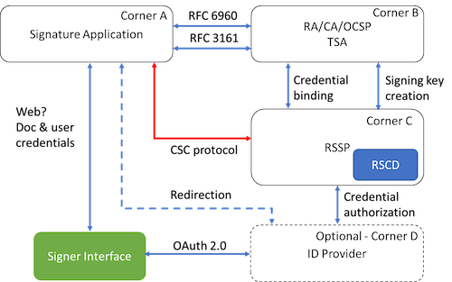

# Architecture 

Here is an image

And here is a table

| Identifier | Definition|
|:------------|:-----------|
|`de_aml`    |The OP verifies and maintains user identities in conforms with the German Anti-Money Laundering Law.|
|`eidas_ial_substantial`| The OP is able to attest user identities in accordance with the EU regulation No 910/2014 (eIDAS) at the identitfication assurance level "Substantial".|
|`eidas_ial_high`|The OP is able to attest user identities in accordance with the EU regulation No 910/2014 (eIDAS) at the identitfication assurance level "High".|
|`nist_800_63A_ial_2`|The OP is able to attest user identities in accordance with the NIST Special Publication 800-63A at the Identity Assurance Level 2.|
|`nist_800_63A_ial_3`|The OP is able to attest user identities in accordance with the NIST Special Publication 800-63A at the Identity Assurance Level 3.|

## Conventions and Terminology

The key words "MUST", "MUST NOT", "REQUIRED", "SHALL", "SHALL
NOT", "SHOULD", "SHOULD NOT", "RECOMMENDED", "NOT RECOMMENDED",
"MAY", and "OPTIONAL" in this document are to be interpreted as
described in BCP 14 [@!RFC2119] [@!RFC8174] when, and only when, they
appear in all capitals, as shown here.

This specification uses the terms "access token", "refresh token",
"authorization server", "resource server", "authorization endpoint",
"authorization request", "authorization response", "token endpoint",
"grant type", "access token request", "access token response", and
"client" defined by The OAuth 2.0 Authorization Framework [@!RFC6749].

# Heading A

see [Introduction](#Introduction)

## Heading AA

# References

[OAuth]: https://tools.ietf.org/html/rfc6749

# Document History

   [[ To be removed from the final specification ]]

   -00 

   *  first draft
